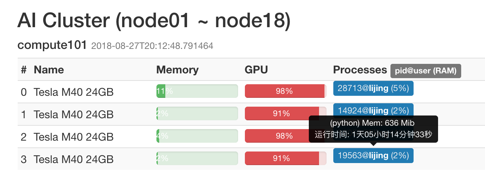

# 容器配置相关问题

## 如何上传文件到集群? / 如何从集群下载文件?
`scp`了解一下
```
# Copy local folder "/home/username/local-dir" to AI cluster directory "/home/username/" 
scp -r /home/username/local-dir username@10.19.124.11:/home/username/

# Copy file "/home/username/project1/result.txt" from AI cluster to path "/home/username/results" on local PC
scp -r username@10.19.124.11:/home/username/project1/result.txt /home/username/results/
```

## 如何查看GPU使用情况?
NVIDIA驱动提供了一个简单的命令行工具`nvidia-smi`:
```
# root @ piaozx.node01 in ~ [12:10:23]
$ nvidia-smi
Mon Aug 27 12:10:25 2018
+-----------------------------------------------------------------------------+
| NVIDIA-SMI 387.26                 Driver Version: 387.26                    |
|-------------------------------+----------------------+----------------------+
| GPU  Name        Persistence-M| Bus-Id        Disp.A | Volatile Uncorr. ECC |
| Fan  Temp  Perf  Pwr:Usage/Cap|         Memory-Usage | GPU-Util  Compute M. |
|===============================+======================+======================|
|   0  Tesla M40 24GB      Off  | 00000000:02:00.0 Off |                    0 |
| N/A   56C    P0   175W / 250W |   2657MiB / 22939MiB |     98%      Default |
+-------------------------------+----------------------+----------------------+
|   1  Tesla M40 24GB      Off  | 00000000:03:00.0 Off |                    0 |
| N/A   49C    P0   140W / 250W |    648MiB / 22939MiB |     91%      Default |
+-------------------------------+----------------------+----------------------+
|   2  Tesla M40 24GB      Off  | 00000000:83:00.0 Off |                    0 |
| N/A   55C    P0   175W / 250W |   1126MiB / 22939MiB |     98%      Default |
+-------------------------------+----------------------+----------------------+
|   3  Tesla M40 24GB      Off  | 00000000:84:00.0 Off |                    0 |
| N/A   46C    P0   142W / 250W |    648MiB / 22939MiB |     71%      Default |
+-------------------------------+----------------------+----------------------+

+-----------------------------------------------------------------------------+
| Processes:                                                       GPU Memory |
|  GPU       PID   Type   Process name                             Usage      |
|=============================================================================|
|    0     28713      C   python                                      1317MiB |
|    1     14924      C   python                                       636MiB |
|    2     16059      C   python                                      1115MiB |
|    3     19563      C   python                                       636MiB |
+-----------------------------------------------------------------------------+
```
显然, 这个工具只能显示一些基本信息, 一些你更关心的信息(谁在跑程序? 跑了多久了?)可以从[AI集群GPU Status](http://10.19.124.11:8899/gpu)获取:



## 如何查看nvidia-driver版本? / cuda版本? / cudnn版本?
### c


## 如何查看python版本?
**查看运行的Python路径** 
```
$ which python
/usr/local/bin/python
```

**查看Python版本**
```
$ python --version
Python 3.6.6
```

## 如何安装Anaconda?

如果觉得平时安装python的包太麻烦，可考虑安装Anaconda, Anaconda集成了巨大部分的python包。具体步骤如下所示(这里以Anaconda-python3.6为例):

1. Download Anaconda-python3.6.
```
$ wget https://repo.anaconda.com/archive/Anaconda3-5.2.0-Linux-x86_64.sh
```
2. 安装Anaconda
```
$ mkdir Anacondas
$ sh Anaconda3-5.2.0-Linux-x86_64.sh
```

3. 在安装过程中，会让你选择Anaconda的安装路径，可以将路径改为
```
$ /root/Anacondas/anaconda3
```


4. 在 zshrc 里面添加Anaconda-python路径
```
$ vim ~/.zshrc
$ export PATH="/root/Anacondas/anaconda3/bin:$PATH"  ## 在zshrc添加路径，然后保存退出
$ source ~/.zshrc

```

5. 检查是否安装成功
```
$ python

Python 3.6.4 |Anaconda, Inc.| (default, Jan 16 2018, 12:04:33)
[GCC 4.2.1 Compatible Clang 4.0.1 (tags/RELEASE_401/final)] on darwin
Type "help", "copyright", "credits" or "license" for more information.
>>>
```
6. 可以再次查看python版本
```
$ which python
/root/Anacondas/anacondas/bin/python
```

## 如何查看pytorch版本? / tensorflow版本?

**查看pytorch版本以及安装指定版本的pytorch**  
[pytorch 官方网址](https://pytorch.org/previous-versions/)
```
1. 查看pytorch版本
$ python

Python 3.6.6 (default, Jun 28 2018, 04:42:43)
[GCC 5.4.0 20160609] on linux
Type "help", "copyright", "credits" or "license" for more information.
>>> import torch
>>> print(torch.__version__)
0.3.1

2. 安装指定版本的pytorch
选择pytorch版本要注意当前环境下的cuda版本以及python版本。如何查询环境cuda以及python版本在本文档中查找对应指令。例如现在的pytorch版本是0.3.1，想升级到0.4.0, 环境是cuda-90，python3.6, 具体步骤如下所示:
$ pip uninstall torch
$ wget http://download.pytorch.org/whl/cu90/torch-0.4.0-cp36-cp36m-linux_x86_64.whl
$ pip install torch-0.4.0-cp36-cp36m-linux_x86_64.whl

3. 再次查看pytorch版本
$ python3
Python 3.6.4 |Anaconda, Inc.| (default, Jan 16 2018, 12:04:33)
[GCC 4.2.1 Compatible Clang 4.0.1 (tags/RELEASE_401/final)] on darwin
Type "help", "copyright", "credits" or "license" for more information.
>>> import torch
>>> print(torch.__version__)
0.4.0a0+200fb22
```


## 显存被看不见的进程占据怎么办?
```
# root @ piaozx.node01 in ~ [12:10:23]
$ nvidia-smi
Mon Aug 27 12:10:25 2018
+-----------------------------------------------------------------------------+
| NVIDIA-SMI 387.26                 Driver Version: 387.26                    |
|-------------------------------+----------------------+----------------------+
| GPU  Name        Persistence-M| Bus-Id        Disp.A | Volatile Uncorr. ECC |
| Fan  Temp  Perf  Pwr:Usage/Cap|         Memory-Usage | GPU-Util  Compute M. |
|===============================+======================+======================|
|   0  Tesla M40 24GB      Off  | 00000000:02:00.0 Off |                    0 |
| N/A   56C    P0   175W / 250W |   2657MiB / 22939MiB |      0%      Default |
+-------------------------------+----------------------+----------------------+
|   1  Tesla M40 24GB      Off  | 00000000:03:00.0 Off |                    0 |
| N/A   49C    P0   140W / 250W |    648MiB / 22939MiB |      0%      Default |
+-------------------------------+----------------------+----------------------+
|   2  Tesla M40 24GB      Off  | 00000000:83:00.0 Off |                    0 |
| N/A   55C    P0   175W / 250W |   1126MiB / 22939MiB |      0%      Default |
+-------------------------------+----------------------+----------------------+
|   3  Tesla M40 24GB      Off  | 00000000:84:00.0 Off |                    0 |
| N/A   46C    P0   142W / 250W |    648MiB / 22939MiB |      0%      Default |
+-------------------------------+----------------------+----------------------+

+-----------------------------------------------------------------------------+
| Processes:                                                       GPU Memory |
|  GPU       PID   Type   Process name                             Usage      |
|=============================================================================|
|                                                                             |
|                                                                             |
|                                                                             |
|                                                                             |
+-----------------------------------------------------------------------------+
```

## 如何开启jupyter?

## 如何开启visdom?

## 如何创建python的虚拟环境?

## 如何配置和使用screen / tmux?

## zsh是什么, 如何配置和使用zsh?

