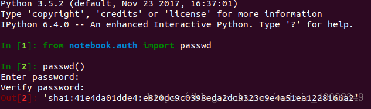

## 如何开启jupyter?
* 安装jupyter
```
pip install jupyter notebook
```
### 配置远程访问jupyter
* 生成密码
```
$ ipython
```
* 在python命令行里分别输入：
```
$ from notebook.auth import passwd
$ passwd()
```
* 输完之后，设定一个密码，会生成一个sha1的秘钥会有如下的结果：

* 记录生成的sha1秘钥，然后退出
```
quit()
```
* 生成jupyter notebook的配置文件
```
$ jupyter notebook --generate-config
$ vim ~/.jupyter/jupyter_notebook_config.py

##  加入如下内容
c.NotebookApp.ip='*'
c.NotebookApp.password = u'sha1:41e4da01dde4:e820dc9c0398eda2dc9323c9e4a51ea1228166a2'
c.NotebookApp.open_browser = False
c.NotebookApp.port =30339  ## 这里填写自己的端口号， 保存退出。
```
* 进入节点，然后打开jupyter:
由于AI集群无法在外面直接访问节点，所以我们需要添加反向代理。

```
$ tmux
$ ctrl-b % ## 将屏幕分为左右两个部分
$ ssh -CNfR 30339:0.0.0.0:30339 admin  ## 添加反向代理, 屏幕左边输入
$ jupyter notebook --allow-root  ## 屏幕右边打开jupyter
```
* 最后我们可以在浏览器中通过访问  **10.19.124.11:30339**, 进入jupyter

## 如何开启visdom?
*  下载visdom
```
$ pip install visdom
```
* 打开visdom   
通常情况下我们都是想要visdom一直在后台运行，所以需要打开tmux, 然后就是打开visdom指定端口。可在[网页端](http://10.19.124.11:8899/permission)查看端口权限。第一次打开visdom会比较慢，因为visdom需要自己下载一些脚本，主要是因为有墙！！！！

```
$ tmux ## 进入tmux
$ python -m visdom.server -p 30330 ## -p 后面填写自己的端口号
```

* 如何在程序中使用visdom，请移步[visdom github](https://github.com/facebookresearch/visdom)主页， 里面有详细的教程。