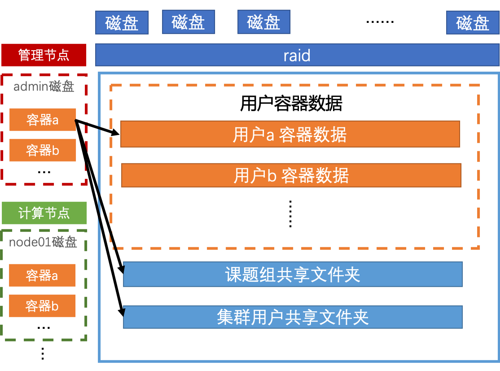

## 数据存储结构总览

## 网络拓扑结构总览
所有计算节点的GPU使用情况可以在[GPU Status](http://10.19.124.11:8899/gpu)中查看

| AI集群内网IP | 节点名字 |         说明          |
| :----------: | :------: | -------------------  |
| 10.10.10.100 |  admin   |       管理节点        |
| 10.10.10.200 |    io    |       存储节点        |
| 10.10.10.101 |  node01  |   计算节点 M40 x 4    |
| 10.10.10.102 |  node02  |   计算节点 M40 x 4    |
| 10.10.10.103 |  node03  |   计算节点 M40 x 4    |
| 10.10.10.104 |  node04  |   计算节点 M40 x 4    |
| 10.10.10.105 |  node05  | 计算节点 GTX1080 x 4  |
| 10.10.10.106 |  node06  | 计算节点 GTX1080 x 4  |
| 10.10.10.107 |  node07  | 计算节点 GTX1080 x 4  |
| 10.10.10.108 |  node08  | 计算节点 GTX1080 x 4  |
| 10.10.10.109 |  node09  | 计算节点 TITAN XP x 4 |
| 10.10.10.110 |  node10  | 计算节点 TITAN XP x 4 |
| 10.10.10.111 |  node11  | 计算节点 GTX1080 x 4  |
| 10.10.10.112 |  node12  | 计算节点 GTX1080 x 4  |
| 10.10.10.113 |  node13  |   计算节点 K80 x 8    |
| 10.10.10.114 |  node14  |   计算节点 K80 x 8    |
| 10.10.10.115 |  node15  | 计算节点 GTX1080 x 4  |
| 10.10.10.116 |  node16  | 计算节点 GTX1080 x 4  |
| 10.10.10.117 |  node17  | 计算节点 GTX1080 x 4  |
| 10.10.10.118 |  node18  | 计算节点 GTX1080 x 4  |

## 显卡性能概览
深度学习对高性能GPU有非常大的需求, 而AI集群中又有各种版本的GPU, 故在此给出简单测试结果, 供大家参考.

**测试环境**: CUDA9.0 + Pytorch0.4 + ResNet50 跑Cifar10  
**分数标准**: 以K80性能为一个基本单位, 可以简单地理解为运算速度, 如P40分数为11.57, 说明同样的网络K80跑一个epoch, P40可以跑11.57个epoch.

