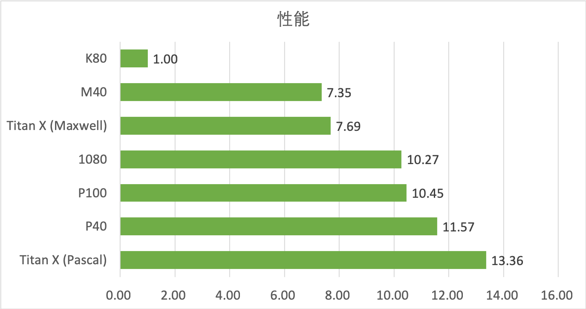

## 数据存储结构总览

## 网络拓扑结构总览
所有计算节点的GPU使用情况可以在[GPU Status](http://10.19.124.11:8899/gpu)中查看

| AI集群内网IP | 节点名字 | CPU | MEM |         GPU         |         说明         |
| :----------: | :------: | :-----------------:  | :-----------------:  | :-----------------:  | :-----------------:  |
| 10.10.10.100 |  admin   | 56 cores  Intel(R) Xeon(R) CPU E5-2690 v4 @ 2.60GHz |  251G  |      None      |       管理节点    |
| 10.10.10.200 |    io    |    40 cores  Intel(R) Xeon(R) CPU E5-2650 v3 @ 2.30GHz    |    62G    |       None       |       存储节点    |
| 10.10.10.101 |  node01  |  28 cores  Intel(R) Xeon(R) CPU E5-2690 v4 @ 2.60GHz  |  251G  |   M40(24G) x 4    |  计算节点 |
| 10.10.10.102 |  node02  |  28 cores  Intel(R) Xeon(R) CPU E5-2690 v4 @ 2.60GHz  |  251G  |   M40(24G) x 4    |  计算节点 |
| 10.10.10.103 |  node03  |  28 cores  Intel(R) Xeon(R) CPU E5-2690 v4 @ 2.60GHz  |  251G  |   M40(24G) x 4    |  计算节点 |
| 10.10.10.104 |  node04  |  28 cores  Intel(R) Xeon(R) CPU E5-2690 v4 @ 2.60GHz  |  251G  |   M40(24G) x 4    |  计算节点 |
| 10.10.10.105 |  node05  |  28 cores Intel(R) Xeon(R) CPU E5-2690 v4 @ 2.60GHz   |  188G  | GTX1080 x 4  | 计算节点 |
| 10.10.10.106 |  node06  |  28 cores  Intel(R) Xeon(R) CPU E5-2690 v4 @ 2.60GHz  |  188G  | GTX1080 x 4  | 计算节点 |
| 10.10.10.107 |  node07  |  28 cores  Intel(R) Xeon(R) CPU E5-2690 v4 @ 2.60GHz  |  188G  | GTX1080 x 4  | 计算节点 |
| 10.10.10.108 |  node08  |  28 cores  Intel(R) Xeon(R) CPU E5-2690 v4 @ 2.60GHz  | 188G | GTX1080 x 4  | 计算节点 |
| 10.10.10.109 |  node09  |  56  cores Intel(R) Xeon(R) CPU E5-2690 v4 @ 2.60GHz  |  188G  | TITAN Xp x 4 | 计算节点 |
| 10.10.10.110 |  node10  |  28 cores  Intel(R) Xeon(R) CPU E5-2690 v4 @ 2.60GHz  |  188G  | TITAN Xp x 4 | 计算节点 |
| 10.10.10.111 |  node11  |  28 cores  Intel(R) Xeon(R) CPU E5-2690 v4 @ 2.60GHz  |  188G  | GTX1080 x 4  | 计算节点 |
| 10.10.10.112 |  node12  |  28 cores  Intel(R) Xeon(R) CPU E5-2690 v4 @ 2.60GHz  |  188G  | GTX1080 x 4  | 计算节点 |
| 10.10.10.113 |  node13  |  28 cores  Intel(R) Xeon(R) CPU E5-2690 v4 @ 2.60GHz  |  251G  |   K80 x 8    |  计算节点 |
| 10.10.10.114 |  node14  |  28 cores  Intel(R) Xeon(R) CPU E5-2690 v4 @ 2.60GHz  |  251G  |   K80 x 8    |  计算节点 |
| 10.10.10.115 |  node15  |  56  cores Intel(R) Xeon(R) CPU E5-2690 v4 @ 2.60GHz  |  251G  | GTX1080 x 4  | 计算节点 |
| 10.10.10.116 |  node16  |  28 cores  Intel(R) Xeon(R) CPU E5-2690 v4 @ 2.60GHz  |  251G  | GTX1080 x 4  | 计算节点 |
| 10.10.10.117 |  node17  |  28 cores  Intel(R) Xeon(R) CPU E5-2690 v4 @ 2.60GHz  |  251G  | GTX1080 x 4  | 计算节点 |
| 10.10.10.118 |  node18  |  56  cores Intel(R) Xeon(R) CPU E5-2690 v4 @ 2.60GHz  |  251G  | GTX1080 x 4  | 计算节点 |
| 10.10.10.119 | node19 | 56 cores  Intel(R) Xeon(R) CPU E5-2680 v4 @ 2.40GHz | 251G | TITAN Xp x 4 | 计算节点 |
| 10.10.10.120 | node20 | 56 cores  Intel(R) Xeon(R) CPU E5-2680 v4 @ 2.40GHz | 251G | TITAN Xp x 4 | 计算节点 |
| 10.10.10.121 | node21 | 56 cores Intel(R) Xeon(R) CPU E5-2680 v4 @ 2.40GHz | 251G | TITAN Xp x 4 | 计算节点 |
| 10.10.10.122 | node22 | 56 cores Intel(R) Xeon(R) CPU E5-2680 v4 @ 2.40GHz | 251G | TITAN Xp x 4 | 计算节点 |
| 10.10.10.123 | node23 | 28 cores  Intel(R) Xeon(R) CPU E5-2680 v4 @ 2.40GHz | 251G | TITAN Xp x 4 | 计算节点 |
| 10.10.10.124 | node24 | 24 cores Intel(R) Xeon(R) CPU E5-2620 v3 @ 2.40GHz | 251G | M40(11G) x 4 | 计算节点 |
| 10.10.10.125 | node25 | 48 cores  Intel(R) Xeon(R) CPU E5-2697 v2 @ 2.70GHz | 377G | K40m x 8 | 计算节点 |
| 10.10.10.126 | node26 | 48 cores Intel(R) Xeon(R) CPU E5-2697 v2 @ 2.70GHz | 377G | K40m x 8 | 计算节点 |

## ib网卡
Network controller: Mellanox Technologies MT27500 Family \[ConnectX-3\]

## Docker Container 内置环境
| 环境     | 版本        | 环境      | 版本      |
| :----------------: | :-----------: | :---------------: | :----------: |
| [ubuntu](https://www.ubuntu.com/)                 | 16.04.4 LTS | [nvidia driver](https://www.nvidia.com/object/unix.html) | 396.44 ( 不可更改) |
| [cuda](https://developer.nvidia.com/cuda-zone)    | 9.0.176     | [cudnn](https://developer.nvidia.com/cudnn)                 | 7.1.4              |
| [python](https://www.python.org/)                 | 3.6.6       | [tensorflow](http://www.tensorflow.org/)                    | 1.9.0              |
| [pytorch](http://pytorch.org/)                    | 0.4.0       | [mxnet](http://mxnet.incubator.apache.org/)                 | 1.2.1              |
| [keras](https://keras.io/)                        | 2.2.2       | [lasagne](http://lasagne.readthedocs.io/)                   | 0.2.dev1           |
| [cntk](http://cntk.ai/)                           | 2.5.1       | [chainer](https://chainer.org/)                             | 4.3.1              |
| [caffe](http://caffe.berkeleyvision.org/)         | 1.0.0       | [caffe2](https://caffe2.ai/)                                | 0.8.2              |
| [torch](http://torch.ch/)                         | 7           | [sonnet](https://github.com/deepmind/sonnet)                | 1.23               |
| [theano](http://deeplearning.net/software/theano) | 1.0.1       |                                                             |                    |

## 显卡性能概览
深度学习对高性能GPU有非常大的需求, 而AI集群中又有各种版本的GPU, 故在此给出简单测试结果, 供大家参考.

**测试环境**: CUDA9.0 + Pytorch0.4 + VGG16 跑Cifar10  
**分数标准**: 以K80性能为一个基本单位, 可以简单地理解为运算速度, 如P40分数为11.57, 说明同样的网络K80跑一个epoch, P40可以跑11.57个epoch.

